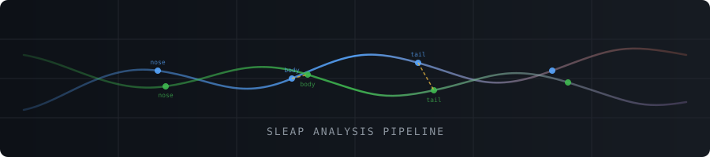

# SLEAP Analysis Pipeline

[](https://www.python.org/downloads/)
[](https://opensource.org/licenses/MIT)



A comprehensive Python pipeline for analyzing animal tracking data generated by [SLEAP](https://sleap.ai/) (Social LEAP Estimates Animal Poses). The pipeline handles trajectory analysis, inter-animal distance calculations, velocity profiling, and cumulative movement statistics — exporting results at multiple temporal resolutions (frame-level, per-second, and per-minute).

---

## Table of Contents

- [Installation](#installation)
- [Quick Start](#quick-start)
- [Advanced Configuration](#advanced-configuration)
- [Individual Analysis Functions](#individual-analysis-functions)
- [Repository Structure](#repository-structure)
- [Output Files](#output-files)
- [Time-Based Analysis](#time-based-analysis)
- [Configuration Options](#configuration-options)
- [Data Requirements](#data-requirements)
- [Best Practices](#best-practices)
- [License](#license)
- [Citation](#citation)

---

## Installation

```bash
git clone https://github.com/IkjotSidhu/SLEAP-downstream-analysis-pipeline.git
cd SLEAP-downstream-analysis-pipeline
pip install -r requirements.txt
```

Or install as a package:

```bash
pip install .
```

**Dependencies:** `numpy`, `scipy`, `matplotlib`, `seaborn`, `h5py`, `pandas`, `sleap`

---

## Quick Start

```python
from sleap_plotting import plotting_SLEAP

results = plotting_SLEAP(
    file_path="data.h5",
    main_node="bodycenter",
    fps=30,
    output_dir="./analysis_results"
)
```

Each run produces:
- Frame-by-frame CSV files with time information
- Per-second aggregated CSV files (`*_by_seconds.csv`)
- Per-minute aggregated CSV files (`*_by_minutes.csv`)
- Publication-ready PDF visualizations

---

## Advanced Configuration

```python
from sleap_plotting import *

# Customize analysis parameters
config = AnalysisConfig()
config.update(
    fps=25,                     # Frame rate
    velocity_window=15,         # Smoothing window
    velocity_poly_order=3,      # Polynomial order
    figure_format='png',        # Output format
    colormap='viridis'          # Color scheme
)

# Run analysis with custom config
results = plotting_SLEAP(
    file_path="data.h5",
    main_node="bodycenter",
    fps=config.fps,
    output_dir="./custom_analysis"
)
```

## Individual Analysis Functions

```python
# Load data
locations, node_names, frame_count, node_count, instance_count = load_sleap_data("data.h5")

# Run specific analyses
plot_node_trajectories(locations, node_index=0, node_name="bodycenter", fps=30)
distances = analyze_inter_mouse_distance(locations, node_index=0, node_name="bodycenter", fps=30)
velocities = analyze_velocities(locations, node_index=0, node_name="bodycenter", fps=30)
analyze_cumulative_distance(locations, node_index=0, node_name="bodycenter", fps=30)
```

Each function generates a frame-level CSV, a per-second CSV (`*_by_seconds.csv`), and a per-minute CSV (`*_by_minutes.csv`).

---

## Repository Structure

```
sleap-analysis-pipeline/
├── sleap_plotting.py          # Main analysis pipeline
├── requirements.txt           # Python dependencies
├── setup.py                  # Package setup
├── README.md                 # This file
├── examples/                 # Example scripts and data
│   ├── example_analysis.py   # Complete example
│   └── sample_config.py      # Configuration examples
└── tests/                    # Unit tests
    ├── test_pipeline.py
    └── test_utils.py
```

---

## Output Files

The pipeline generates both visualizations and data files for further analysis.

### PDF Visualizations

| File | Description |
|------|-------------|
| `{node}_locations.pdf` | Time-series position plots |
| `{node}_Node-Mouse-Tracking-plot.pdf` | Spatial trajectory plots |
| `{node}_Inter-Mouse-Distance-by-Frame.pdf` | Distance plots by frame |
| `{node}_Inter-Mouse-Distance-by-second.pdf` | Distance plots by time |
| `Mouse-1-{node}-velocity-plot.pdf` | Velocity analysis for animal 1 |
| `Mouse-2-{node}-velocity-plot.pdf` | Velocity analysis for animal 2 |
| `Cumulative-distance-over-time-{node}.pdf` | Cumulative movement analysis |

### CSV Data Files

#### Frame-by-Frame Data

| File | Columns |
|------|---------|
| `{node}_trajectories.csv` | frame, time_seconds, mouse1_x, mouse1_y, mouse2_x, mouse2_y |
| `{node}_inter_mouse_distances.csv` | frame, time_seconds, inter_mouse_distance_pixels, mouse1_x, mouse1_y, mouse2_x, mouse2_y |
| `{node}_velocities.csv` | frame, time_seconds, mouse1/2_velocity_pixels_per_frame, mouse1/2_velocity_pixels_per_second |
| `{node}_cumulative_distances.csv` | frame, time_seconds, mouse1/2_frame_distance, mouse1/2_cumulative_distance |

#### Per-Second Aggregation

| File | Statistical Measures |
|------|---------------------|
| `{node}_trajectories_by_seconds.csv` | mean positions per mouse |
| `{node}_inter_mouse_distances_by_seconds.csv` | mean, std, min, max, count + average positions |
| `{node}_velocities_by_seconds.csv` | mean, std, min, max for velocities + average positions |
| `{node}_cumulative_distances_by_seconds.csv` | sum, mean, count of frame distances + final cumulative values |

#### Per-Minute Aggregation

| File | Statistical Measures |
|------|---------------------|
| `{node}_trajectories_by_minutes.csv` | mean positions per mouse |
| `{node}_inter_mouse_distances_by_minutes.csv` | mean, std, min, max, count + average positions |
| `{node}_velocities_by_minutes.csv` | mean, std, min, max for velocities + average positions |
| `{node}_cumulative_distances_by_minutes.csv` | sum, mean, count of frame distances + final cumulative values |

---

## Time-Based Analysis

Multi-resolution CSV exports offer flexibility across different analysis needs:

- **Frame-level**: Full resolution for detailed inspection
- **Per-second**: Reduced noise, suitable for behavioral pattern detection
- **Per-minute**: Compact summaries ideal for long recordings or statistical software (R, SPSS, etc.)

**Example — hourly activity from per-minute data:**

```python
import pandas as pd

minute_data = pd.read_csv("bodycenter_velocities_by_minutes.csv")
minute_data['hour'] = minute_data['time_minutes'] // 60
hourly_activity = minute_data.groupby('hour')['mouse1_velocity_pixels_per_second_mean'].mean()
print(hourly_activity)
```

---

## Configuration Options

```python
config = AnalysisConfig()
config.fps = 25                      # Frame rate (Hz)
config.velocity_window = 15          # Smoothing window size
config.velocity_poly_order = 3       # Polynomial order for Savitzky-Golay filter
config.velocity_vmin = 0             # Velocity plot minimum
config.velocity_vmax = 20            # Velocity plot maximum
config.figure_format = 'pdf'         # Output format: 'pdf', 'png', or 'svg'
config.figure_dpi = 300              # Figure resolution
config.colormap = 'plasma'           # Matplotlib colormap
```

---

## Data Requirements

The pipeline expects HDF5 files exported from SLEAP containing:
- `tracks`: 4D array of shape `(frames, nodes, coordinates, instances)`
- `node_names`: list of keypoint names

---

## Best Practices

**Data preparation:**
- Verify SLEAP predictions are of good quality before running analysis
- Choose stable, well-tracked nodes (e.g., `bodycenter`, `centroid`) as the primary node
- Confirm frame rate settings match your video

**Analysis tips:**
- Use a velocity smoothing window of 30+ frames for typical recordings
- Check missing data percentage before analysis
- For long recordings, use per-minute aggregated CSVs to reduce memory usage
- Choose temporal resolution based on analysis goals: frame-level for fine detail, second/minute-level for behavioral patterns

**Troubleshooting:**
- **Import errors**: Verify all dependencies are installed
- **File not found**: Check file paths and HDF5 accessibility
- **Node not found**: Confirm node names match your SLEAP model
- **Memory issues**: Analyze shorter segments or use aggregated exports

---

## License

This project is licensed under the MIT License — see the [LICENSE](LICENSE) file for details.

---

## Citation

If you use this pipeline in your research, please cite:

```bibtex
@software{sleap_analysis_pipeline,
  title   = {SLEAP Analysis Pipeline},
  author  = {Ikjot Sidhu},
  year    = {2025},
  url     = {https://github.com/IkjotSidhu/SLEAP-downstream-analysis-pipeline}
}
```

---

## Contributors

| Name | Role |
|------|------|
| [Ikjot Sidhu](https://github.com/IkjotSidhu) | Author & maintainer |
| [Claude](https://claude.ai) (Anthropic) | AI pair-programmer — code review, refactoring, documentation |

---

## Issues & Support

- **Bug reports**: [GitHub Issues](https://github.com/IkjotSidhu/SLEAP-downstream-analysis-pipeline/issues)
- **Feature requests**: [GitHub Discussions](https://github.com/IkjotSidhu/SLEAP-downstream-analysis-pipeline/discussions)
